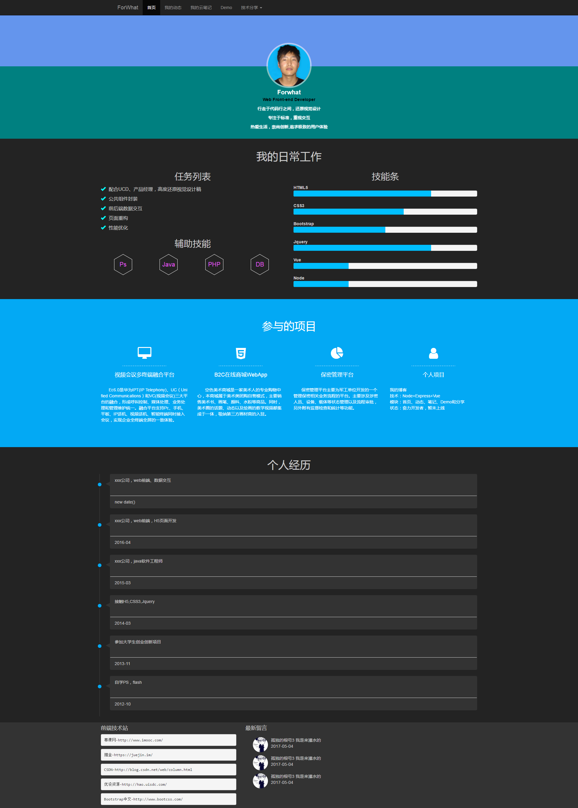
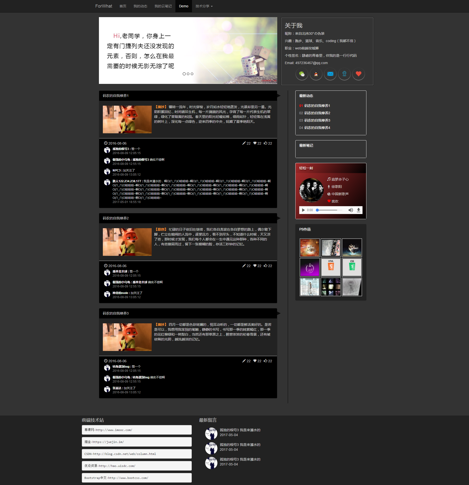

# webblog
> 项目介绍

 + 名称：Forwhat的博客
 + 类型：个人博客
 + 技术栈：node,express,vue
 + 版本：5.1
 + 简介：互联网时代，人们通过各种方式记录生活的每一个有意义的瞬间，有时是qq的一条说说，有时是微信的一个“朋友圈”，有时是一张美颜的自拍，还有各种show...
  然而我要做的这件事有点特别，它是通过一行行代码编制而成，一个个字符组合起来，抽象的说应该是个通过一个个0101开始记录的。然而这个过程是比较痛苦（各种入坑，再爬出来）的。然而结果却是意外的，满满成就感飘过... 言归正传，博客是node+express+vue对之前写的进行了彻底的重构，前端-》后台。目的也是为了学习node和vue的一次项目实践。没有数据库，数据是通过node的文件系统模块读写json实现的，后期会尝试用mongodb替换。目前只实现了动态的评论和回复功能，近期会将主页设计为个人简历，目前还在借鉴与参考...待续
  
> 如何运行项目
 + 1.项目down下来后，进入blog文件夹，打开命令行终端，执行<pre>npm install --save  安装依赖的包</pre>
 + 2.执行<pre>npm start</pre>
 + 3.浏览器localhost:3000

# look at now!
> 首页

- - - - - - - - - - - - - 
> 动态

